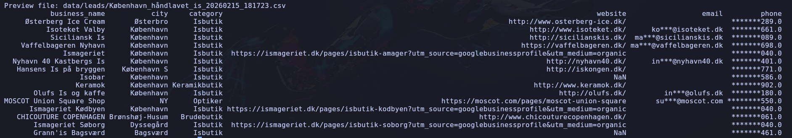
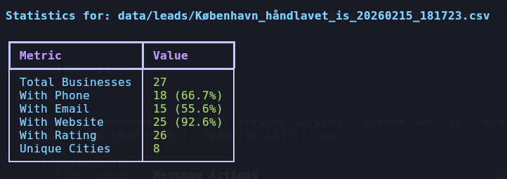

# Google Maps Lead Intelligence Scraper

Python automation for building B2B lead lists from Google Maps and company websites, with contact enrichment and CSV exports ready for sales workflows.

## Problem Solved

Manual lead research is slow, inconsistent, and hard to scale across multiple markets. This project automates prospect discovery by collecting structured business records from Google Maps and enriching them with website-level contact details.

## Key Features

- Multi-market scraping by city, keyword, or translated business type via `main.py`.
- Contact enrichment with phone normalization (E.164) and website email crawling.
- Batch operations via shell scripts for country and region campaigns.
- CAPTCHA and popup handling with alerting for long-running jobs.
- Optional VPN integration with event-based rotation logic for resilience.
- Automatic deduplication, CSV export, and summary statistics.
- Additional domain-based crawler (`scrape_domains.py`) for existing website lists.

## Tech Stack

- Python 3
- Playwright + playwright-stealth
- BeautifulSoup + Requests
- Pandas
- Rich + tqdm
- YAML-based configuration

## Screenshots

### Running main.py 

### CSV Output 

### Statistics Table

## Contact

For project discussions, freelance collaboration, or implementation support:

- Name: `Lukasz Kedzielawski`
- Email: `l.kedzielawski@gmail.com`

